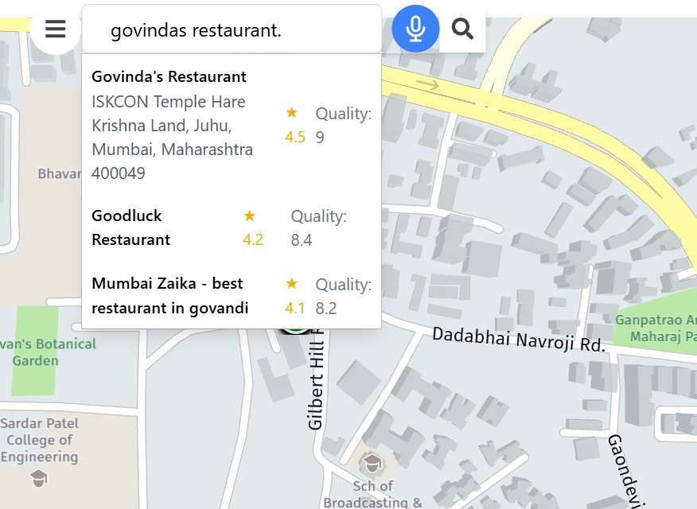
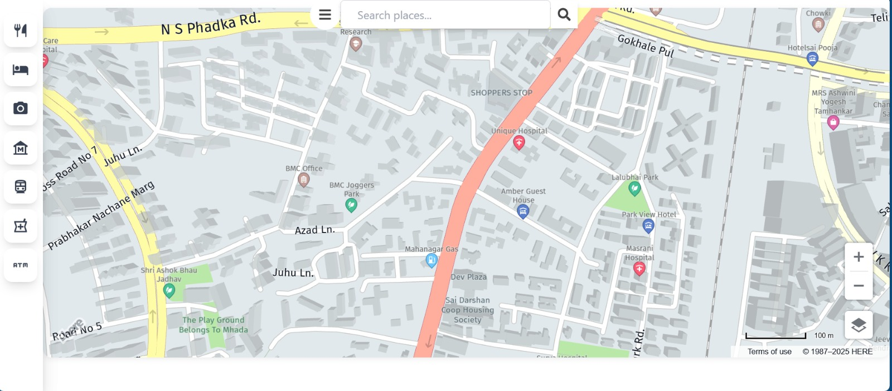
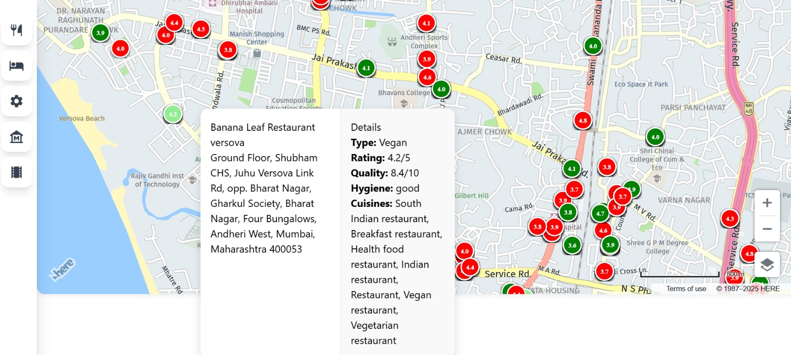

# 🍽️ RestORoute - Personalized Restaurant Recommender

RestORoute is a smart restaurant recommendation system that helps users find restaurants that perfectly match their dietary preferences and requirements. Using HERE Maps for location services and a powerful Elasticsearch backend, it provides personalized restaurant suggestions based on user preferences, location, and dietary restrictions.

## ✨ Features

- 🥗 Comprehensive dietary preference filtering (Vegan, Vegetarian, Halal, Gluten-free, Keto, etc.)
- 📍 Location-based restaurant search using HERE Maps
- 🔍 Smart search with auto-suggestions
- 🗣️ Voice search capability
- 🚗 Route planning to restaurants
- ⭐ Restaurant quality and hygiene ratings
- 💬 User reviews and ratings system

## 🛠️ Tech Stack

### Frontend
- React.js
- HERE Maps JavaScript API
- Tailwind CSS
- Speech Recognition API

### Backend
- FastAPI
- Elasticsearch
- Python
- uvicorn

## 🚀 Getting Started

### Frontend Setup

1. Install dependencies:
```bash
pnpm install
```

2. Create a `.env` file in the root directory and add your HERE Maps API key:
```
VITE_HERE_API_KEY=your_here_maps_api_key
```

3. Start the development server:
```bash
pnpm start
```

### Backend Setup

1. Install dependencies using either uv (recommended) or pip:

Using uv:
```bash
uv sync
```

Using pip:
```bash
python -m pip install -r requirements.txt
```

2. Set up Elasticsearch:
- Make sure Elasticsearch is running on your system
- Configure the connection in `backend/config.py`

3. Start the FastAPI server:
```bash
cd backend
uvicorn main:app --reload
```

## 🗄️ Project Structure

```
├── frontend/
│   ├── src/
│   │   ├── components/      # React components
│   │   ├── context/         # React context providers
│   │   ├── Pages/          # Page components
│   │   └── utils/          # Utility functions
│   └── public/             # Static assets
├── backend/
│   ├── main.py            # FastAPI application
│   ├── models.py          # Data models
│   ├── config.py          # Configuration
│   └── es.py             # Elasticsearch client
└── data/                 # Sample data and scripts
```

## 🔍 API Endpoints

### Search Restaurants
```http
POST /api/v1/search
```

Parameters:
- `query`: Search text
- `cuisine_types`: List of cuisine types
- `dietary_preferences`: Dietary restrictions
- `min_rating`: Minimum rating filter
- `location`: Location search

## 🎯 Features in Detail

### Dietary Preferences
- Support for multiple dietary restrictions
- Allergen information
- Religious dietary requirements (Halal, Kosher)
- Special diets (Keto, Paleo)

### Location Services
- Real-time location tracking
- Route planning
- Distance calculation
- Area-based search

### Search Capabilities
- Voice search
- Auto-suggestions
- Fuzzy matching
- Multi-criteria filtering

## 📸 Screenshots

### Map View with Restaurant Locations


### User Preferences Setup


### Restaurant Details and Route Planning


## 📝 License

[MIT License](LICENSE)
